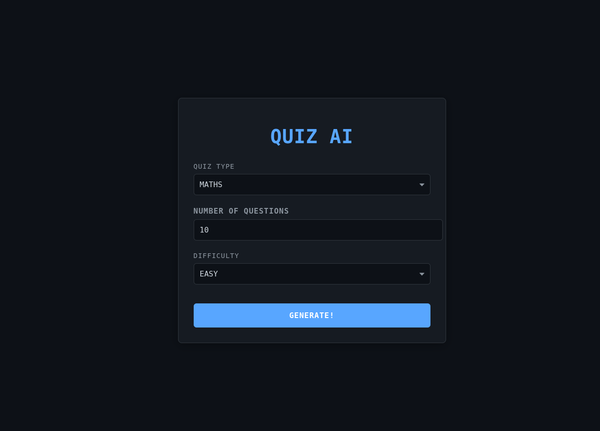

# 🧠 QuizAI - Interactive Quiz Application
 *Replace with your actual screenshot*

## 🌟 Features

- **Dynamic Quiz Generation** - Create quizzes from various categories (Math, Politics, Music, etc.)
- **Customizable Difficulty** - Choose between Easy, Medium, or Hard levels
- **Beautiful UI** - Modern dark theme with smooth animations
- **State Management** - Powered by Zustand for efficient global state
- **Responsive Design** - Works on all device sizes
- **Interactive Experience** - Real-time feedback and scoring

## 🛠️ Tech Stack

- **Frontend**: 
  - React 18
  - Vite (Build Tool)
  - Zustand (State Management)
  - React Router 6 (Navigation)
  - Tailwind CSS (Styling)

- **Backend**:
  - Spring Boot (Java)
  - REST API

## 🚀 Getting Started

### Prerequisites

- Node.js (v16+ recommended)
- npm or yarn
- Java JDK 17+ (for backend)

### Installation

1. **Clone the repository**
   ```bash
   git clone https://github.com/ikedestiny/QuizAiFrontend
   cd quizai
   ```

2. **Install frontend dependencies**
   ```bash
   cd frontend
   npm install
   ```

3. **Run the development server**
   ```bash
   npm run dev
   ```

4. **Start the backend**
   ```bash
   cd ../backend
   ./mvnw spring-boot:run
   ```

The app will be available at `http://localhost:5173`

## 📂 Project Structure

```
quizai/
├── frontend/
│   ├── src/
│   │   ├── components/       # Reusable components
│   │   ├── pages/            # Application pages
│   │   ├── store/            # Zustand store
│   │   ├── assets/           # Static assets
│   │   ├── App.jsx           # Main app component
│   │   └── main.jsx          # Entry point
│   └── vite.config.js        # Vite configuration
└── backend/
    ├── src/main/java/...     # Spring Boot application
    └── pom.xml               # Maven configuration
```

## 🎨 Theming & Styling

The app uses a modern dark theme with the following CSS variables:

```css
:root {
  --bg-dark: #0d1117;
  --bg-darker: #010409;
  --accent: #58a6ff;
  --text-primary: #c9d1d9;
  --text-secondary: #8b949e;
}
```

Customize these in `src/index.css` to match your brand.

## 🧪 Testing

Run tests with:
```bash
npm test
```

## 🏗️ Build for Production

```bash
npm run build
```

The production build will be in the `dist` folder.

## 🤝 Contributing

1. Fork the project
2. Create your feature branch (`git checkout -b feature/AmazingFeature`)
3. Commit your changes (`git commit -m 'Add some amazing feature'`)
4. Push to the branch (`git push origin feature/AmazingFeature`)
5. Open a Pull Request

## 📜 License

Distributed under the MIT License. See `LICENSE` for more information.

## ✉️ Contact

Ike Destiny - ikedestiny18@gmail.com
Telegram    - ike_the_vinci

Project Link: [https://github.com/ikedestiny/QuizAiFrontend](https://github.com/ikedestiny/QuizAiFrontend)

## 🎉 Acknowledgements

- [React Icons](https://react-icons.github.io/react-icons/)
- [Zustand Documentation](https://zustand-demo.pmnd.rs/)
- [ViteJS](https://vitejs.dev/)
- [Tailwind CSS](https://tailwindcss.com/)

---

